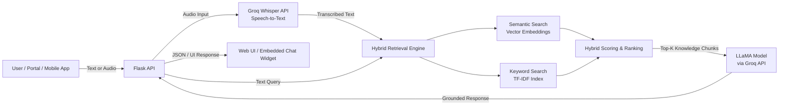

# Llama Knowledge Base AI Agent


An end-to-end **AI Agent** built with **Flask**, **Groq-hosted LLaMA models**, and **hybrid retrieval (semantic + keyword)**, designed to answer questions **strictly from a user-provided Microsoft Word (.docx) knowledge base**.

This README reflects the **current architecture** of the agent, including hybrid search, KB versioning, table-aware ingestion, OpenAPI documentation, and operational best practices.

The agent supports:
- Text and audio prompts
- **Hybrid retrieval (semantic + keyword) over a Word-document KB**
- Voice transcription using **Groq’s hosted Whisper API**
- Persistent, versioned KB storage
- A modern web chat UI
- Embedding as a bottom-right widget in any web portal
- **OpenAPI (Swagger) documentation** for all endpoints

---

## Project Overview

**Key features**
- Upload a Word document as a Knowledge Base (KB)
- Hybrid search (SentenceTransformers + TF-IDF)
- Grounded answers using Groq-hosted LLaMA models
- Voice input (browser, `.wav`, `.m4a`)
- KB persistence and version switching
- Flask-based web UI
- Embeddable bottom-right chat widget
- OpenAPI / Swagger documentation
- MIT licensed (dual attribution)

---

## Retrieval Architecture (Hybrid – Important)

This agent uses **hybrid retrieval**, combining semantic similarity with keyword matching.

### Scoring logic

```
final_score = α * semantic_score + (1 - α) * keyword_score
```

- Semantic search captures meaning and intent
- Keyword search captures exact terms, tables, IDs, and regions
- Hybrid retrieval significantly improves accuracy for structured documents
- The hybrid approach reduces hallucinations by enforcing KB grounding

---

## System Architecture Diagram (For Proposals & Integrators)



### Architectural notes
- The LLaMA model only sees **top-ranked KB excerpts**, never the full document
- Audio transcription is performed using **Groq-hosted Whisper**
- Hallucination is mitigated by strict KB-grounded prompting
- The architecture supports web UI, iframe embedding, and direct API access
- Suitable for **enterprise and government deployments**

---

## Clone the Repository

```bash
git clone https://github.com/your-org/llama-kb-agent.git
cd llama-kb-agent
```

---

## Python & Virtual Environment Setup

### Required Python Version
```
Python 3.11.9
```

### macOS

```bash
python3.11 -m venv .venv
source .venv/bin/activate
pip install --upgrade pip
```

### Windows (PowerShell)

```powershell
py -3.11 -m venv .venv
.venv\Scripts\activate
python -m pip install --upgrade pip
```

---

## Install Requirements

```bash
pip install -r requirements.txt
```

---

## Environment Variables (.env)

```env
GROQ_API_KEY=your_groq_api_key_here
HYBRID_SEARCH=true
HYBRID_ALPHA=0.70
```

---

## Run the Application

```bash
python app.py
```

Open in your browser:

```
http://127.0.0.1:8000/
```

---

## API Documentation (OpenAPI / Swagger)

The agent exposes a fully documented OpenAPI specification.

- **Swagger UI (interactive documentation):**
```
http://127.0.0.1:8000/docs
```

- **OpenAPI specification (JSON):**
```
http://127.0.0.1:8000/openapi.json
```

---

## OpenAPI Screenshots (for Proposals & Documentation)

For proposals, reports, and technical documentation, include screenshots of the Swagger UI to demonstrate API completeness and transparency.

Recommended screenshots:
- **Swagger UI – Endpoint Overview**
- **Chat Endpoints (`/chat_text`, `/chat`)**
- **Knowledge Base Management (`/upload_kb`, `/kb/*`)**

Suggested structure:
```
docs/
└── screenshots/
    ├── swagger_overview.png
    ├── chat_endpoints.png
    └── kb_management.png
```

---

## Upload Knowledge Base (KB)

```bash
curl -X POST http://localhost:8000/upload_kb \
  -F "file=@your_document.docx"
```

---

## KB Reloading (Hybrid Search)

Hybrid retrieval builds an in-memory keyword index.

```bash
curl -X POST http://127.0.0.1:8000/kb/reload
```

---

## Test Queries

```bash
curl -X POST http://127.0.0.1:8000/chat_text \
  -H "Content-Type: application/json" \
  -d '{"message":"List Digital Hubs in the Coast region"}'
```

---

## Embedding the Agent in a Web Portal

### Option A (Recommended): Floating Bottom-Right Widget

A ready-made example is included as:

```
iframe_widget.html
```

Replace:

```html
src="https://YOUR_AGENT_DOMAIN_OR_IP/"
```

With:

```
http://127.0.0.1:8000/        (local testing)
https://agent.yourcompany.com (production)
```

---

## For Integrators (Portal & App Teams)

### Integration options
- Iframe embed
- Direct REST API calls
- Audio-first workflows

### Enterprise deployment notes
- Protect administrative endpoints
- Restrict `/docs` in production
- Deploy behind HTTPS
- Enable logging and monitoring

---

## License

MIT License  

© 2025 Gideon Aswani / Pathways Technologies Ltd

---

## Third-Party Model Notice

This project uses **LLaMA-family models served via the Groq API**.
No model weights are distributed.

Usage is subject to:
- Groq API Terms of Service
- Meta LLaMA Acceptable Use Policy
